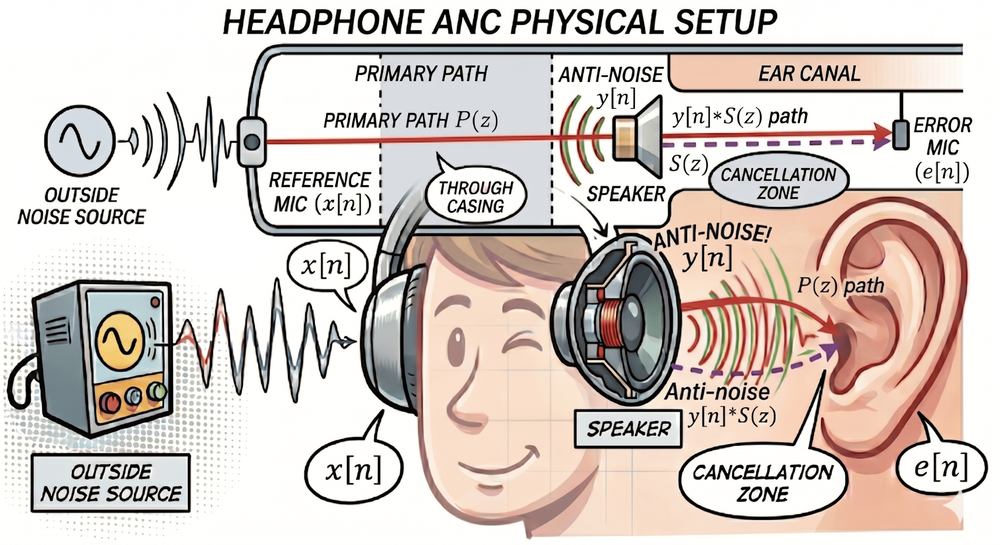

# 🎧 2026 Advanced Signal Processing Hackathon: The Silent Zone

## —— AI-Collaborative Development Challenge for ANC Headphone Systems

### 1. Project Overview

Welcome, Engineers! You are now a Senior Audio Algorithm Engineer at a top-tier tech firm. Your mission is to design and implement the core ANC (Active Noise Cancellation) firmware for a next-generation in-ear headphone.

In this **Human-AI Collaborative Hackathon**, you will have 135 minutes to leap from theoretical modeling to industrial-grade algorithm implementation using AI Coding tools (e.g., Cursor, GitHub Copilot, or ChatGPT).

---

### 2. Quick Start

```bash
# 1. Create environment (or use your own)
conda create -n hackathon python=3.12 -y
conda activate hackathon

# 2. Install dependencies
pip install -r requirements.txt

# 3. Listen to the raw signals
python play_audio.py

# 4. Start coding!  Edit anc_algorithm.py
```

---

### 3. Physical Architecture & System Modeling

Before diving into the code, you must understand the signal flow within the acoustic space of the headphone:



- **Reference Microphone (Reference Mic, `x[n]`):** Located on the **outer shell** of the headphone. Due to the physical isolation of the casing, it captures external ambient noise only.
- **Primary Path (Primary Path, `P(z)`):** The physical path through which ambient noise penetrates the headphone shell and cushions to reach the eardrum.
  - **Desired Signal `d[n]`:** Defined as `d[n] = x[n] * p[n]`. This is the **actual noise you hear** inside the ear if the cancellation is turned off.
- **Headphone Speaker (Speaker, `y[n]`):** Plays the "anti-noise" wave generated by your algorithm.
- **Secondary Path (Secondary Path, `S(z)`):** The **total path** starting from the DSP output, through the DAC, amplifier, speaker diaphragm vibration, and ear canal air propagation, finally reaching the error microphone.
- **Error Microphone (Error Mic, `e[n]`):** Located **inside** the ear canal. It measures the residual noise after cancellation:

```math
e[n] = d[n] + s[n] * y[n]
```

---

### 4. Data Files

All data is in the `data/` folder:

| File | Description | Used in |
|---|---|---|
| `x_ref.npy` | Reference microphone signal (ambient noise) | Phase I & II |
| `d_target.npy` | Target signal at eardrum (noise through `P(z)`) | Phase I |
| `s_path_impulse.npy` | Secondary path impulse response (256 taps, ~10 ms delay) | Phase II |
| `music.npy` | Music source (for demo playback) | Demo |
| `noise_source.wav` | Noise audio (for listening) | Demo |
| `music.wav` | Music audio (for listening) | Demo |

**Signal parameters:** Sample rate = 16,000 Hz, Duration = 10 s

> **💡 Why is `d[n]` provided instead of `P(z)`?**
>
> In a real ANC headphone, `d[n]` is not directly observable — the error microphone measures the superposition `e[n] = d[n] + S(z) * y[n]`. However, in this offline simulation there is no physical microphone, so we provide pre-computed `d[n]` for you to simulate the error signal in code: `e[n] = d[n] - y[n]`. This is equivalent to the error microphone reading in a real system — the algorithm logic is identical.
>
> `P(z)` itself is the **unknown system** that the adaptive filter `W(z)` must learn — if P(z) were given directly, there would be no need for an adaptive algorithm.

---

### 5. The Two-Phase Challenge

> **⚠️ Important Workflow: Derive First, Code Second**
>
> Each phase requires you to **complete the mathematical derivation before writing any code**. Specifically:
> 1. Work with AI to derive the complete algorithm update equations step by step, starting from the objective function;
> 2. Once the derivation is verified, translate the formulas into Python code.
>
> Your report must include the full derivation process. **Skipping derivation and directly generating code via AI will not be accepted.**

#### **Phase I: The "Ideal" Headphone (LMS Validation)**

- **Scenario:** Assume the secondary path is instantaneous and distortion-free (`S(z) = 1`).
- **Data:** Load `x_ref.npy` and `d_target.npy`.
- **Tasks:**
  1. **Formula Derivation:** Work with AI to derive the standard LMS adaptive filter weight update equation from the MSE cost function (including the error signal, gradient estimate, and weight iteration steps). Record the derivation in your report.
  2. **Code Implementation:** Based on your derivation, write Python code to implement the LMS filter and attempt to cancel `d[n]`.
  3. **Analysis & Tuning:** Record the convergence process and find the optimal step size `μ` for the fastest MSE decay.
- **Output:** Your code must produce an array `e_lms` of shape `(N,)` — the residual error signal.

#### **Phase II: The "Oscillation" Reality (FxLMS Evolution)**

- **Scenario:** Introduce the realistic secondary path impulse response `s_path_impulse.npy`. You will find that your Phase I code causes the system to diverge or "howl" due to phase delays.
- **Tasks:**
  1. **Diagnosis & Formula Derivation:** Work with AI to analyze why the delay in `S(z)` causes standard LMS to diverge. Then, starting from the corrected cost function, derive the complete **Filtered-x LMS (FxLMS)** weight update equation. Record the derivation in your report.
  2. **Code Implementation:** Based on your derivation, implement the FxLMS algorithm.
    - **Key Logic:** Filter the reference signal `x[n]` through a model of the secondary path `Ŝ(z)` before updating the weights.
  3. **Result Verification:** Restore system stability and calculate the final **Noise Attenuation (SNR Improvement)** in dB.
- **Output:** Your code must produce an array `e_fxlms` of shape `(N,)` — the FxLMS residual error signal.

---

### 6. How `anc_algorithm.py` Works

The template file `anc_algorithm.py` has a simple structure:

```
┌─────────────────────────────────────┐
│  0. Load Data (pre-filled)          │
├─────────────────────────────────────┤
│  Phase I: Your LMS code here       │
│  ↓ produce: e_lms                  │
│  ── Evaluation (auto) ──────────── │
│  • Prints attenuation (dB)         │
│  • Saves phase1_result.png         │
├─────────────────────────────────────┤
│  Phase II: Your FxLMS code here    │
│  ↓ produce: e_fxlms               │
│  ── Evaluation (auto) ──────────── │
│  • Prints attenuation (dB)         │
│  • Saves phase2_result.png         │
│  • Saves spectrum_comparison.png   │
│  • Plays before/after audio demo   │
└─────────────────────────────────────┘
```

**You only need to fill in your algorithm code.** The evaluation sections run automatically and will:

1. Calculate and display **Noise Attenuation (dB)** for each phase
2. Generate **time-domain plots** (`phase1_result.png`, `phase2_result.png`)
3. Generate **spectrum comparison** (`spectrum_comparison.png`) — noise PSD before ANC vs after LMS vs after FxLMS
4. Play an **audio demo** — what the ear hears before and after ANC (requires `sounddevice`)

---

### 7. Hackathon Timeline (135 Minutes)


| Time              | Segment                 | Key Actions                                                     |
| ----------------- | ----------------------- | --------------------------------------------------------------- |
| **13:30 - 13:45** | **Briefing**            | TA explains the background and distributes data packets.        |
| **13:45 - 14:25** | **Phase I: Foundation** | Derive the LMS formula and implement the algorithm with AI.     |
| **14:25 - 15:15** | **Phase II: Advanced**  | Tackle the `S(z)` delay; derive and implement FxLMS.            |
| **15:15 - 15:45** | **Lab Review**          | Generate comparison charts and draft the report via AI.         |

> **🎤 Demo Showdown:** Starting from Phase I, you may request a demo with the TA at any time after completing a phase. **First come, first served — demo slots are limited!** The earlier you finish, the higher you rank.


---

### 8. Collaboration Rules & Deliverables

- **AI Usage:** Your report must include **all critical AI dialogue content** (complete conversation screenshots or text covering formula derivation, problem diagnosis, code implementation, etc.).
- **Deliverables:**
  1. `anc_algorithm.py`: Your final, clean Python script (must produce `e_lms` and `e_fxlms`).
  2. `report.pdf`: Including the auto-generated plots (`phase1_result.png`, `phase2_result.png`, `spectrum_comparison.png`), MSE convergence curves, and AI collaboration insights.
- **Grading Rubric:**
  - **40% Performance:** Noise attenuation depth (dB) and system stability.
  - **30% Derivation:** Completeness and correctness of LMS / FxLMS formula derivations.
  - **20% Analysis:** Depth of explanation regarding the FxLMS compensation principle and divergence analysis.
  - **10% Efficiency:** Code vectorization and the quality of AI-human interaction.

---

### 💡 Suggested AI Prompts for Success

> **Derivation phase:**
> - "Starting from the MSE cost function `J = E[e²[n]]`, derive the LMS adaptive filter weight update equation step by step."
> - "After introducing the secondary path `S(z)` in an ANC system, why is the original LMS gradient estimate no longer correct? Please derive the corrected FxLMS update equation."
>
> **Implementation phase:**
> - "Based on the FxLMS update equation we just derived, help me implement this algorithm in Python/NumPy."
> - "Given a 10ms delay in the secondary path, how should I tune the step size `μ` to prevent the system from diverging?"

---

**© 2026 Advanced Signal Processing Hackathon Committee**
